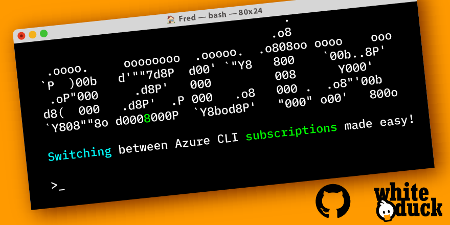

#  &nbsp; `azctx`: Power tool for the Azure CLI 




**`azctx`** helps you switch between azure cli subscriptions back and forth:


## Collaborate with us 👋

* Feel free to give us your **feedback**, make **suggestions** or let us discuss in our 📢 [**discussions tab**](../../discussions/).
* To report **issues** or search for existing issues go to the 🔎 [**issues tab**](../../issues/).

_And please star this repo ⭐_

## azctx

```bash
azctx is a CLI tool for managing azure cli subscriptions.
        It is a helper for the azure cli and provides a simple interface for managing subscriptions.
        Pass a subscription name to select a specific subscription.
        Pass - to switch to the previous subscription.

Usage:
  azctx [- / -- NAME] [flags]
  azctx [command]

Available Commands:
  completion  Generate the autocompletion script for the specified shell
  help        Help about any command
  login       Login to Azure
  version     Print the CLI version

Flags:
  -c, --current               Display the current active subscription
      --filter-tenant-level   Filter tenant level accounts with no available subscriptions (default true)
  -h, --help                  help for azctx
  -s, --short                 Use a short prompt.
                                Deprecated. Size is now automatically determined.

Use "azctx [command] --help" for more information about a command.
```

```bash
Login to Azure (wrapped around 'az login')
        Authenticates the CLI instance to Azure and fetches all available tenants and subscriptions.
        All args after -- are directly passed to the 'az login' command.

Usage:
  azctx login [flags]

Flags:
      --force-mfa   force individual authentication for each tenant separately (required for tenants which enforce explicit MFA)
  -h, --help        help for login
```

-----

## Installation

### Homebrew (macOS)

* Install `azctx` with `brew install whiteducksoftware/tap/azctx`

### Chocolatey (Windows)

* Install `azctx` with `choco install azctx`

### Binary (Windows, Linux, macOS)

* Install the `azctx` binary from the [repository](https://github.com/whiteducksoftware/azctx/releases)
* Add the `azctx` binary to your PATH

-----

## Troubleshooting

### Error: `AZURE_CONFIG_DIR is not set / a valid directory. [...]`

Run `az configure` once to create the configuration directory.

Check the [Microsoft Documentation](https://docs.microsoft.com/en-us/cli/azure/azure-cli-configuration?view=azure-cli-latest#cli-configuration-file) for the correct path to the azure cli config directory and export it as AZURE_CONFIG_DIR environment variable.  

```bash
export AZURE_CONFIG_DIR=$HOME/.azure
```

-----

## Migrate from stiviik/azctx

Are you an existing user of `stiviik/azctx`? Use the following commands to migrate from the old `stiviik/azctx` to the new `whiteducksoftware/azctx` repository:

```bash
brew uninstall azctx
brew untap stiviik/tap
brew install whiteducksoftware/tap/azctx
```
